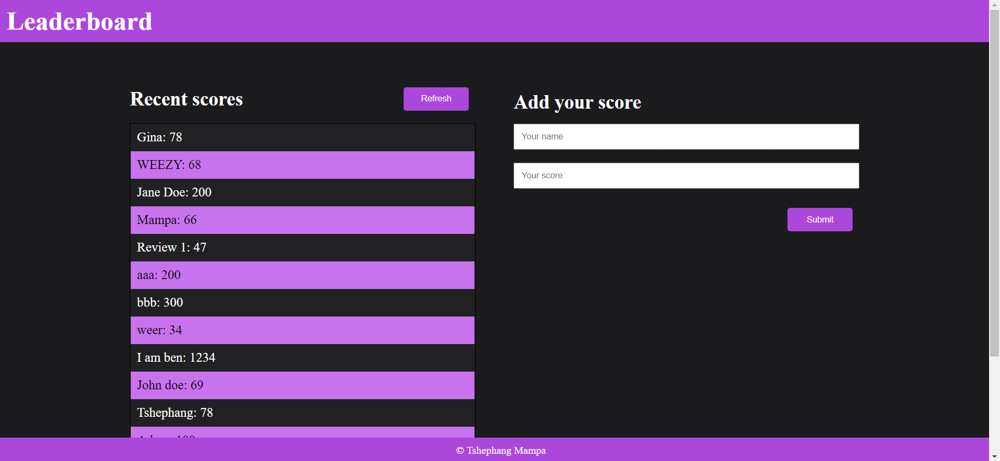

# Leaderboard
> The leaderboard website displays scores submitted by different players. It also allows you to submit your score. All data is preserved with the external Leaderboard API service.

## Built With

- HTML
- CSS
- JavaScript(ES6)
- Webpack

## Live demo

[Live demo link]()

## Getting Started

### To get a local copy run the following steps:

- Copy this link `https://github.com/tmampa/Leaderboard.git`
- Open your terminal or command line
- Run `git clone` and paste the link
- Open the folder with your code editor
- Create a branch to work on
- Run `npm install`
- Run `npm run build`
- Run `npm run start` to launch the server.

## Author

👤 **Tshephang Mampa**

- GitHub: [@tmampa](https://github.com/tmampa)
- Twitter: [@Tshephang_](https://twitter.com/tshephang_)
- LinkedIn: [Tshephang Mampa](https://www.linkedin.com/in/tshephangmampa/)

## 🤝 Contributing

Contributions, issues, and feature requests are welcome!

Feel free to check the [issues page](https://github.com/tmampa/Leaderboard/issues).

## Show your support

Give a ⭐️ if you like this project!

## Acknowledgments

- Learning partners, Standup and morning session team